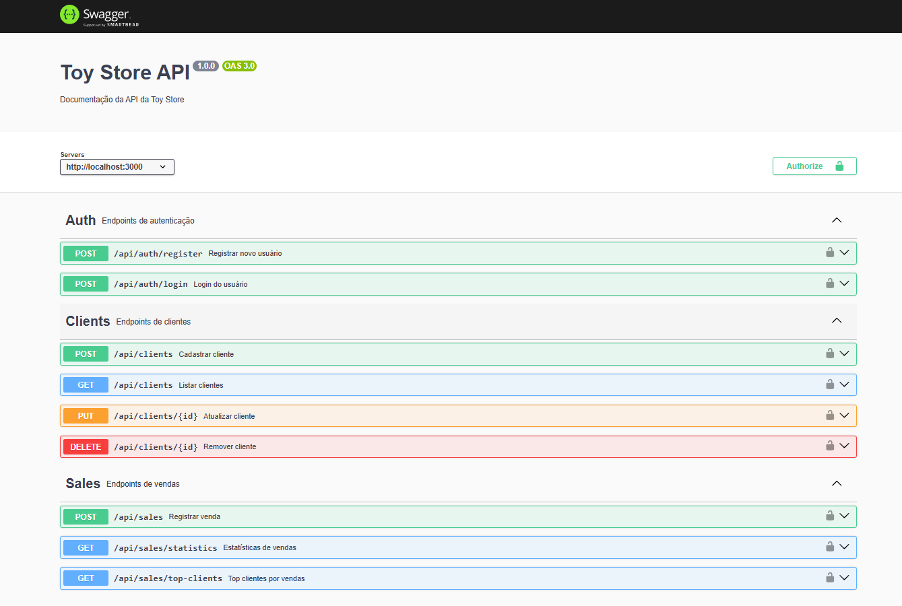

# Apresentação Oral do Projeto Toy Store

Olá! Vou te apresentar rapidamente o projeto Toy Store, que é composto por dois grandes módulos: a API (backend) e o Frontend.

## API (Backend)

A API da Toy Store foi desenvolvida em Node.js com TypeScript e Express. Ela é responsável por toda a lógica de negócio, autenticação de usuários via JWT, cadastro e gerenciamento de clientes, além do controle de vendas. A arquitetura segue o padrão MVC, separando bem as responsabilidades entre controllers, services, models e rotas. Os dados são persistidos e protegidos por middlewares de autenticação. Os testes automatizados garantem a qualidade do código.

### Documentação da API (Swagger)

## Frontend

O frontend foi construído com Next.js, React e TypeScript, utilizando também Tailwind CSS para estilização. Ele consome a API da Toy Store, oferecendo uma interface moderna, responsiva e fácil de usar para gerenciar clientes, autenticação e vendas. O projeto utiliza tRPC para comunicação typesafe com o backend, além de ferramentas como ESLint e Prettier para manter o código limpo e padronizado.

## Como funciona na prática

O usuário acessa o frontend, faz login e pode cadastrar, editar ou visualizar clientes e vendas. Todas as ações são enviadas para a API, que processa, valida e retorna os dados necessários. Assim, o sistema garante segurança, organização e uma ótima experiência para o usuário final.

---

## Telas do Sistema

### Login

### Dashboard de Clientes

### Listagem e Cadastro de Clientes

